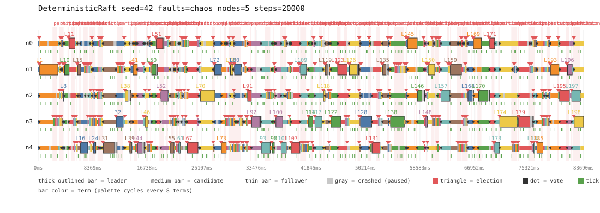

# DeterministicRaft - Raft consensus, verified by deterministic simulation testing

[](https://github.com/Leo-Y-Zhang/DeterministicRaft/actions/workflows/ci.yml)
[](https://www.python.org/downloads/)
Proprietary - All Rights Reserved (c) 2026 Leo-Y-Zhang - portfolio viewing only.

A paper-faithful implementation of the Raft consensus algorithm (Ongaro &
Ousterhout, *In Search of an Understandable Consensus Algorithm*, USENIX ATC
2014) where the entire cluster runs inside a **seeded discrete-event
simulator**. Because the simulator owns the clock, the RNG and the network,
every message drop, delay, reorder, partition and crash is perfectly
reproducible from a single seed — and the paper's five safety properties are
machine-checked after *every* simulator step. The non-obvious part: the
network is not something the tests work around, it *is* the test harness, so
consensus bugs that normally hide in rare message interleavings get surfaced
and reproduced on demand.

*The name is literal: a Raft implementation whose safety properties are machine-
verified on every step of every seeded run, rather than argued for in prose.*

```
$ deterministic_raft check --seeds 300 --faults chaos
deterministic_raft check: seeds 0..299 nodes=5 faults=chaos steps=5000
seeds=300 faults=chaos invariant_checks=1500000 violations=0
```

That is 1.5 million invariant checks (300 adversarial network schedules x
5000 steps) with zero violations. When an invariant *does* fail during
development, the run prints its seed and step, and `deterministic_raft replay --seed N`
reproduces the failure byte-for-byte. The technique — deterministic
simulation testing — is the one FoundationDB and TigerBeetle use for real
databases (no affiliation; it is the inspiration).

## Why this exists

Distributed consensus bugs are notoriously hard to reproduce: they live in
message interleavings that ordinary unit tests never explore. Deterministic
simulation inverts the problem by making the network schedule an explicit,
seeded input. DeterministicRaft is a compact, readable demonstration of that idea
applied to the most teachable consensus algorithm.

## What a run looks like

```
$ deterministic_raft run --nodes 5 --seed 47 --faults chaos --steps 20000
...
commands: submitted=129 committed=126 config_changes=0
invariants: OK (20000 checks, one after every step)
trace digest: sha256:e922a29bdf03d040afcd645957631d08ab8f1f565d0a286b7fd9c0fef9e1df00
final logs:
  n0 up   role=leader    term=176 commit=126  applied=126  len=128  log sha256:8be4055887f1
  n1 up   role=follower  term=177 commit=126  applied=126  len=126  log sha256:40f3fac899e1
  n2 up   role=follower  term=176 commit=126  applied=126  len=128  log sha256:8be4055887f1
  n3 down role=follower  term=177 commit=0    applied=0    len=126  log sha256:40f3fac899e1
  n4 up   role=leader    term=177 commit=126  applied=126  len=126  log sha256:40f3fac899e1
```

Read that closely — after 20,000 steps of chaos (drops, duplicates, delays,
reordering, partitions, crashes) the final frame is a safety lesson in five lines:

- **Two nodes print `leader`, and that is legal.** Election Safety is *per term*:
  `n4` leads term 177 while a partitioned `n0` still believes it leads term 176 —
  it has not yet heard that it was deposed.
- **Every up node agrees on the same 126 committed, applied commands** (Log
  Matching and State Machine Safety, machine-checked after every one of the
  20,000 steps). The two extra entries on the deposed leader's side (`len=128`
  vs `commit=126`) are uncommitted: no node has applied them, and Raft promises
  nothing about an entry until it commits.
- **`n3` is crashed mid-run.** Its volatile state really is gone (`commit=0`),
  but its persisted log hashes identical to the current leader's
  (`40f3fac899e1`) — exactly what must survive a crash, and nothing more.

That is Raft's safety guarantee, visible in a shell. Run the command yourself and
you get this exact output; `replay` with the same arguments re-derives the same
trace digest byte-for-byte — twice, comparing the two attempts.

Pass `--timeline out.svg` to any `run` to emit a dependency-free SVG timeline
(terms, elections, commits and partitions per node over virtual time):

```
deterministic_raft run --nodes 5 --seed 42 --faults chaos --steps 20000 --timeline out.svg
```

The committed example below is `docs/showcase-timeline.svg`, produced by exactly
that command — regenerating it today is byte-identical to the checked-in file,
which is the determinism guarantee doing its job:



## The five safety properties -> checked invariants

All five live in `deterministic_raft/invariants.py` and are evaluated together after
every simulator step by `InvariantChecker`:

| Paper property | Checked by |
|---|---|
| Election Safety — at most one leader per term | `_check_election_safety` |
| Leader Append-Only — a leader never overwrites its own log | `_check_leader_append_only` |
| Log Matching — same index+term implies identical logs up to it | `_check_log_matching` |
| Leader Completeness — committed entries survive into future leaders' logs | `_check_leader_completeness` |
| State Machine Safety — no two nodes apply different commands at an index | `_check_state_machine_safety` |

Beyond the paper's five, the checker also enforces commit-index monotonicity
per node and — since membership changes made majorities per-node state — a
per-configuration commit quorum: a newly committed entry must actually be held
by a majority of the committing node's *current* configuration.

Each property also has focused unit tests (forced log divergence and repair,
stale leaders, split votes), plus a bounded liveness check: under
`none`/`light` faults, submitted commands must commit within a step budget.

## Beyond the log: a client-observable linearizability oracle

The five properties above check what nodes' *logs* do. They cannot see whether
what *clients* observed is a legal single-copy history. DeterministicRaft's replicated
state machine is a small key-value store (`put` / `get` / `cas`) with per-client
exactly-once sessions, and every run records a client history of
invoke/return/observed operations. `deterministic_raft/linearizability.py` then decides
whether that history is **linearizable** — whether some total order of the
operations respects real-time ordering and makes every observed result legal
(Wing–Gong "linearize and remove", as in Jepsen/Knossos). Raft guarantees it, so
every `none`/`light`/`chaos` run passes; the oracle catches the client-visible
bugs — stale reads, acknowledged-but-lost writes, double-applied retries — that
the internal invariants structurally cannot express.

## Testing the tester: injectable bugs

A verifier is only trustworthy if it catches real defects, so `deterministic_raft/bugs.py`
carries a registry of deliberately-injectable consensus bugs, **all off by
default** (an armed-with-`NO_BUGS` run is byte-identical to an un-armed one). Each
is caught by exactly the property it targets:

| Injected bug | Breaks | Caught by |
|---|---|---|
| `drop_commit_term_guard` | §5.4.2 Figure 8 (commits a prior-term entry by replica count) | prior-term commit (mechanism pinned) / State Machine Safety |
| `vote_for_stale_candidate` | §5.4.1 election restriction | Leader Completeness |
| `skip_log_consistency` | §5.3 log matching | Log Matching |
| `allow_commit_regression` | commit-index monotonicity | Commit Index Monotonic |
| `stale_local_reads` | reads bypass the log (no leadership check) | **the linearizability oracle only** |
| `drop_config_commit_guard` | the **real May-2015 membership bug** (see below) | Leader Completeness |

`stale_local_reads` is the oracle's reason to exist: it slips past every internal
invariant and is caught only by the client-history oracle. See `tests/test_bugs.py`.

### The historical one: the 2015 single-server membership bug

The sixth bug is not invented. The single-server membership algorithm *as published
in the Raft dissertation* let a freshly elected leader append a configuration change
before committing anything in its own term. Diego Ongaro corrected it on the raft-dev
mailing list in May 2015: two leaders elected under the same base configuration can
each install a different single-server change whose majorities do **not** overlap,
and one of them then overwrites the other's *committed* entries.
`drop_config_commit_guard` resurrects the algorithm exactly as it stood 2014-2015,
and DeterministicRaft catches the loss both ways:

- **Mechanism, replayed exactly** (`tests/test_membership.py`): universe `{0..4}`,
  voters `{0,1,2,3}`. `n0` (leader, term 1) starts adding `n4`; concurrently `n1`
  (leader, term 2) removes `n0` and commits entries with the two-server majority
  `{1,2}` of its shrunken configuration; `n0` is then re-elected with `{0,3,4}` — a
  majority of *its* five-server configuration, disjoint from `{1,2}` — and overwrites
  the committed entries. Leader Completeness fires the moment the stale leader
  returns. The guarded twin of the test shows the amendment refusing both unguarded
  appends — and the very commit that satisfies the guard also blocks the disjoint
  election.
- **In the wild + shrunk** (`tests/test_membership.py`, `tests/test_shrink.py`): a
  1000-seed hunt found the same loss in ordinary membership churn at six servers,
  chaos seed 354 (pinned); ddmin then reduces it to a 1-minimal, step-trimmed,
  byte-identically replayable counterexample. A five-server control sweep stays clean
  even with the guard dropped — every reachable pair of configurations there has
  overlapping majorities (3+3 > 5), so the bug *needs* the sixth server. That rarity
  is the story: the bug survived public review for about a year.

## Shrinking a failure to a minimal counterexample

A seed that fails somewhere in 20,000 steps with dozens of faults is a haystack.
`deterministic_raft/shrink.py` delta-debugs it into the needle: given a failing scenario, it
runs [Zeller's ddmin](https://www.st.cs.uni-saarland.de/dd/) over the fault
injections to a *1-minimal* set (suppressing any one more makes the bug vanish),
then binary-searches the step budget — each candidate a fresh, mask-driven,
byte-identical replay, so the shrinker is itself perfectly deterministic. Point it
at an injected bug and it hands back the handful of partitions and crashes that
actually matter, plus a runnable replay. The fault-suppression mask leaves the RNG
stream untouched when empty, so an un-shrunk run is bit-for-bit an ordinary one.

## Directing the chaos: the nemesis vocabulary

The random fault driver *explores* the fault space; a nemesis *directs* it.
`deterministic_raft/nemesis.py` is a vocabulary of declarative fault patterns —
`partition_halves`, `isolate_leader` (resolved at fire time against whoever
currently believes it leads), `flapping_link`, `lossy_link`, `crash_node` —
composed into a `NemesisSchedule`: pure, validated data pinned to virtual-time
instants, serialized to a compact JSON form that round-trips exactly. The name
and the idea are Jepsen's nemesis process (no affiliation); the determinism is
DeterministicRaft's. Every command takes `--nemesis`:

```bash
deterministic_raft run --nodes 3 --faults none --steps 4000 --nemesis \
  '[{"pattern":"partition_halves","at":400,"duration":600},{"pattern":"crash_node","node":1,"at":1200,"duration":400}]'
```

With `--faults none` the profile injects nothing, so both faults in that run's
output (`partitions=1 ... crashes=1`) are the schedule's; with `light` or
`chaos` the schedule layers structure over random noise, still byte-identically
replayable. Three rules keep schedules first-class citizens of the existing
machinery rather than a parallel mechanism: patterns draw **zero randomness** of
their own; every injection consumes an ordinal from the **same suppression mask**
as the random driver, so ddmin minimises a hand-authored schedule with no new
code paths and a violation's printed replay command quotes the schedule back
verbatim; and validation is **total** — unknown patterns, missing, extra or
non-integer fields, out-of-range probabilities and runaway flap counts are all
usage errors (exit 2) before the first simulator step, never mid-run crashes.

The payoff (`tests/test_nemesis.py`): the injectable-bug registry is re-caught
when the adversity is *directed* — a hand-authored campaign of minority-starving
halves splits and leader isolations over `light` noise trips each bug's own
invariant (and `stale_local_reads` still falls only to the oracle) — and the
May-2015 membership bug, whose natural repro needed a 1000-seed chaos hunt,
reproduces under directed 3|3 halves splits at six servers at a pinned seed,
with the guarded twin surviving the identical campaign.

## Full Raft: crash-restart, snapshots, linearizable reads

The core is not a toy subset — the hard sections of the paper are here, each behind
a config flag and each with its own determinism-pinned golden matrix:

- **Real crash-restart (Figure 2).** A crash discards *all* volatile state; only
  `currentTerm`, `votedFor` and the log survive. A restart rebuilds the state
  machine by replaying the log — the checker tracks a per-node *incarnation* so a
  legitimately-reset commit index is not mistaken for a regression.
- **Log compaction + `InstallSnapshot` (§7).** Once enough applied entries pile up,
  a node folds its committed prefix into a snapshot and discards it; a follower that
  falls behind the compaction point is re-seeded with the whole state-machine image.
  The invariant checker was generalized *in lockstep* to reason over
  (compacted prefix + live tail) — with planted-bug tests proving it still catches a
  real cross-boundary divergence and never false-positives on legal compaction.
- **ReadIndex linearizable reads (§8).** A `get` is served from local state without a
  log entry, but only after the leader confirms it still leads (a majority of
  heartbeat acks in its term) *and* has committed an entry in its own term. The
  linearizability oracle earned its keep here — it caught stale reads while that
  second condition was missing.
- **Single-server membership changes (dissertation ch. 4).** A configuration entry in
  the log names the voting set and takes effect the moment it is *appended*
  (pre-commit); elections, commits and ReadIndex confirmations all count majorities
  over the current configuration, and the invariant checker judges commit quorums
  per-configuration (again generalized in lockstep, with planted-bug tests). Two
  guards make effective-on-append safe: one change in flight at a time, and — the
  May-2015 amendment — no change until the leader has committed an entry in its own
  term. Membership is derived state: it survives crash-restart, log truncation,
  compaction into a snapshot and `InstallSnapshot`, always rebuilt from the
  log/snapshot. `Cluster(membership=True)` (CLI: `--membership`) starts one server
  outside the configuration and runs a deterministic, zero-randomness churn driver
  that adds and removes one server at a time — proposing to *every* node that
  believes it is leader, so a partitioned stale leader keeps pushing its own change.

## Install & run

Requires Python 3.11+. Zero runtime dependencies; dev deps are pytest, mypy and ruff.

```bash
python -m venv .venv
.venv/Scripts/python.exe -m pip install -e ".[dev]"   # Windows
# .venv/bin/python -m pip install -e ".[dev]"          # Linux/macOS

python -m pytest -q              # 471 tests (a longer sweep is marked slow)
python -m mypy deterministic_raft      # clean (strict)
python -m ruff check .           # clean

deterministic_raft run    --nodes 5 --seed 42 --faults chaos --steps 20000 --timeline out.svg
deterministic_raft check  --seeds 300 --faults chaos
deterministic_raft check  --seeds 100 --faults chaos --membership   # + single-server churn
deterministic_raft replay --seed 42       # identical to run: byte-for-byte event trace
deterministic_raft report --seed 42 --faults chaos --out report.html   # self-contained HTML
```

`deterministic_raft report` writes one standalone HTML page — run summary, fault/verification
stats, the inline SVG timeline and the linearizability verdict — the whole run on a
single shareable artifact. A committed example (the same seed-42 chaos run as the
timeline above) lives at `docs/showcase-report.html`.

The `deterministic_raft` console script is installed by the editable install; the same
commands run via `python -m deterministic_raft ...` without it.

Exit codes: `0` success / no violations, `1` invariant violation (with seed
and step), `2` usage error.

## Architecture

```
deterministic_raft/
  sim.py              discrete-event core: virtual clock, event queue, seeded RNG,
                      network faults (drop/duplicate/delay/reorder/partition)
  node.py             the Raft state machine: election, replication, commit rules,
                      log repair, crash-restart, snapshots/InstallSnapshot, ReadIndex,
                      single-server membership changes
  kv.py               the replicated key-value state machine, structured commands,
                      per-client sessions, snapshots, client-op history
  invariants.py       the five safety properties, evaluated after every step
                      (crash-, snapshot- and configuration-aware)
  linearizability.py  the client-history oracle (Wing-Gong linearize-and-remove)
  bugs.py             injectable consensus bugs (all off by default)
  shrink.py           ddmin schedule shrinker -> minimal counterexample
  nemesis.py          declarative fault-schedule vocabulary (hand-authored chaos)
  cluster.py          wires N nodes to the simulated network; client + fault +
                      membership-churn + nemesis drivers
  timeline.py         SVG timeline renderer (no dependencies)
  report.py           self-contained HTML run report
  cli.py              run / check / replay / report
tests/                471 tests: unit, scenario, invariant sweeps, oracle, shrinker,
                      nemesis, crash-restart, snapshots, ReadIndex, membership,
                      determinism goldens
```

Design rule: `node.py` contains *only* the algorithm — no I/O, no clocks, no
randomness of its own — which is exactly what makes it simulable.

## Scope & limitations

Deliberately honest about the edges:

- **Linearizability is checked over a bounded key-value register model** (`put` /
  `get` / `cas`). The oracle's search is bounded (concurrency width and a
  states-explored budget); it is a sound *detector* of non-linearizable histories
  for the workloads here, not a general model checker.
- **Membership changes are single-server only** (add or remove ONE server at a
  time, per dissertation ch. 4) — the full joint-consensus C-old,new protocol is
  deliberately out (single-server teaches the same quorum-overlap lesson with far
  less determinism surface). Simplifications on top: a leader refuses to remove
  itself; a new server is added without the ch. 4.2.1 catch-up phase (it converges
  via ordinary log repair or `InstallSnapshot` after joining); and there is no
  pre-vote/leadership-transfer mitigation, so a removed server that never learned of
  its removal can still disrupt liveness with elections (safety is unaffected).
- **No real disk I/O**: "stable storage" is modelled in memory (a crash clears
  volatile state and a restart rebuilds from the persisted log/snapshot). Real
  files would inject OS-level nondeterminism for no correctness gain.
- Fault injection covers message-level faults and node crash/restart; it does
  **not** model Byzantine behaviour (Raft assumes non-Byzantine nodes).
- Liveness is checked only under bounded fault profiles — under sustained chaos,
  Raft correctly prioritizes safety over progress, so no liveness guarantee is
  asserted there.
- **A single-voter cluster never commits.** `--nodes 1` elects a leader and accepts
  commands, but the commit rule is only evaluated when an `AppendEntries` reply
  arrives, and with no peers none ever does. Safety holds (trivially); nothing
  progresses. Known defect, written up in `docs/APP_FLOW.md`.

Educational / portfolio project; deterministic simulation testing is the inspiration
of FoundationDB, TigerBeetle and Jepsen (no affiliation).

## Design documents

Written after the fact, from the code rather than from this README:
[PRD](docs/PRD.md) (problem, scope, rejected alternatives) ·
[TDD](docs/TDD.md) (architecture as built, the determinism contract, failure modes) ·
[App Flow](docs/APP_FLOW.md) (the CLI surface, every state, the exit codes) ·
[Design Brief](docs/DESIGN_BRIEF.md) (the timeline and report, with measured contrast).

## Roadmap

- Joint-consensus membership (C-old,new) if a second quorum lesson ever earns its
  determinism cost.
- Evaluate the commit rule after a leader's own append, so a single-voter
  configuration can make progress.

## License

Proprietary - All Rights Reserved (c) 2026 Leo-Y-Zhang - portfolio viewing only.
