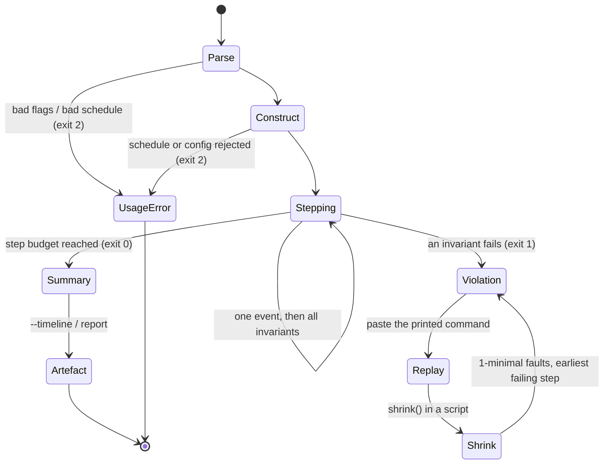

# App Flow — the DeterministicRaft command line

No GUI, no interactive prompt. The user-facing surface is one console script with four
subcommands, two file artefacts and three exit codes. It is documented exhaustively here
because for a verification tool the *output* is the product: a violation that cannot be
reproduced from what was printed is a bug report nobody can act on. Every transcript below
is real output from the shipped version.

See [PRD.md](PRD.md) and [TDD.md](TDD.md).

## The loop the whole tool exists for

A violation prints its own reproduction. This is real output, from the historical May-2015
membership bug armed at six servers, chaos seed 354:

```
[LeaderCompleteness] leader n4 (term 84) is missing committed entry
Entry(term=83, command='cfg:0,1,2,3,5') at index 60 (seed=354 step=5784)
-- reproduce with: deterministic_raft replay --nodes 6 --seed 354 --faults chaos --membership
```

The message carries the property that failed, the concrete entry that was lost, the seed
*and* the step, and a runnable command — the whole point of deterministic simulation
compressed into one line. From a library script, `shrink()` then reduces it to a 1-minimal
fault set and the earliest failing step budget.

One caveat, stated because it matters for exactly this transcript. The replay hint carries
`--membership` and `--nemesis` but **not** the injectable-bug flags, since those have no
CLI representation. For a genuine defect — the case the hint exists for — it reproduces
exactly. For a deliberately-armed bug like the one above, the printed command runs the
*fixed* algorithm and correctly finds nothing.

## Getting in

```bash
deterministic_raft <command> [args]          # console script from the editable install
python -m deterministic_raft <command>       # identical; no install step needed
```

`run`, `check`, `replay`, `report`. All four accept `--nodes`, `--faults
{none,light,chaos}`, `--steps`, `--membership` and `--nemesis JSON`. There is deliberately
no flag that arms an injectable bug: `bugs.py` is reachable only from the test suite, so no
invocation of the shipped binary can turn a defect on.

## Getting to a violation in the first place

**`check`** is the ten-second version — sweep many seeds, get one number.

```
$ deterministic_raft check --seeds 100 --faults chaos
deterministic_raft check: seeds 0..99 nodes=5 faults=chaos steps=5000
seeds=100 faults=chaos invariant_checks=500000 violations=0
```

**`run`** takes one seed in detail: message and fault counts, the trace digest, and the
final state of every node.

**`replay --seed N`** makes the determinism claim checkable. It runs the same configuration
twice and compares the two event traces byte for byte.

```
$ deterministic_raft replay --seed 7 --faults chaos --steps 4000
attempt 1 digest: sha256:fd5cd28b418e8db42cfed9fd13a865fea54d40c7489735c14056ec9294f7ae73
attempt 2 digest: sha256:fd5cd28b418e8db42cfed9fd13a865fea54d40c7489735c14056ec9294f7ae73
replay verified: 6042 trace events, byte-identical
```

**`report --out page.html`** produces the shareable artefact: summary cards, fault and
verification counts, the inline SVG timeline, the linearizability verdict, and a footer
carrying the exact command that reproduces the run.

## Every state of every command

| Command | Nothing to do | Clean | Violation | Usage error |
|---|---|---|---|---|
| `run` | `--steps 0` prints a complete, honest zero report (`0 checks`, empty-string digest `e3b0c442…`) rather than nothing | full summary + final logs, exit **0**; with `--timeline`, `timeline written: <path>` | `INVARIANT VIOLATION: [name] detail (seed=… step=…) -- reproduce with: …`, exit **1** | exit **2** |
| `check` | `--seeds 0` prints the totals line with zeroes | `seeds=N … violations=0`, exit **0** | one `seed N: VIOLATION …` line per failing seed, then `reproduce the first failure with:` and the command, exit **1** | exit **2** |
| `replay` | — | both digests plus `replay verified: N trace events, byte-identical`, exit **0** | either attempt raising ⇒ `attempt K: INVARIANT VIOLATION: …`; or `replay FAILED: traces differ`, which means a determinism bug in DeterministicRaft itself, exit **1** | exit **2** |
| `report` | — | `report written: <path> (linearizable=True, N ops checked)`, exit **0** | violation before the page is written ⇒ nothing written, exit **1** | exit **2** |

Usage errors are total and early. Two layers produce them, both exiting 2:

```
$ deterministic_raft run --nodes 3 --steps 10 --nemesis '[{"pattern":"nope","at":1}]'
deterministic_raft run: error: argument --nemesis: unknown pattern 'nope';
  expected one of ['crash_node', 'flapping_link', 'isolate_leader', 'lossy_link', 'partition_halves']

$ deterministic_raft run --nodes 3 --steps 10 --nemesis '[{"pattern":"crash_node","node":9,"at":100,"duration":50}]'
deterministic_raft: error: nemesis schedule names node n9; this cluster only has n0..n2

$ deterministic_raft run --nodes 2 --membership --steps 100
deterministic_raft: error: membership mode needs at least three nodes
```

The first is argparse: the schedule failed to parse or validate. The second and third are
`Cluster.__init__` rejecting a schedule or configuration the parser could not know was
wrong, caught in `main()` and reported as a usage error rather than a traceback. Every one
fires **before the first simulator step**, so a bad argument can never surface as a mid-run
crash, and no stack trace ever reaches the user.

There is no unauthorised state, no loading state and no offline state, because there is no
network, no account and no remote call.

## Transitions



The `Violation → Replay → Shrink → Violation` cycle is the design centre. It terminates
because each pass is strictly smaller: ddmin returns a 1-minimal fault set, then the step
budget is binary-searched down to the earliest step at which the same failure signature
still fires.

## Two dead ends, both honest

**A single-node cluster never commits.** `deterministic_raft run --nodes 1` elects `n0` leader
and accepts client commands, but `_advance_commit` is only ever called from
`_on_append_reply` — with no peers, no reply ever arrives, so the commit index stays at 0
forever. Verified: 5000 steps, `submitted=3 committed=0`, `len=3`. Safety invariants hold
trivially, so nothing reports a problem; the run simply does nothing. The same stall would
apply to any configuration that shrank to one voter, which the membership churn driver
cannot reach but a library caller could construct via `initial_voters`. This is a real
defect, recorded here and in the TDD rather than papered over. The fix is to attempt a
commit after a leader's own append, not only on a reply.

**The oracle's search budget produces a verdict the user cannot act on.** Exhausting
500,000 states prints `NOT LINEARIZABLE` with the message "search budget exhausted; result
undetermined". A user reading only the badge would chase a violation that may not exist. No
current configuration reaches the budget; the fix is a three-valued verdict.

Neither is a state a user can get *stuck* in — every command still terminates and returns
an exit code — but in both the output is less useful than it looks, which is the same
defect class.

## Scripting and accessibility

No ANSI colour anywhere in the CLI output, verified by the absence of escape sequences in
the source. Nothing is conveyed by colour, so the tool reads identically in a pipe, a log
file, a CI transcript and a screen reader.

Exit codes are the machine-readable channel — `0` clean, `1` violation, `2` usage error —
and CI depends on exactly that and nothing else. Every number printed is also available
structurally through `RunResult.stats`, for callers who would rather not parse text. The
columns in `final logs` are fixed-width and stable across runs, so a diff between two runs
is readable line by line.
